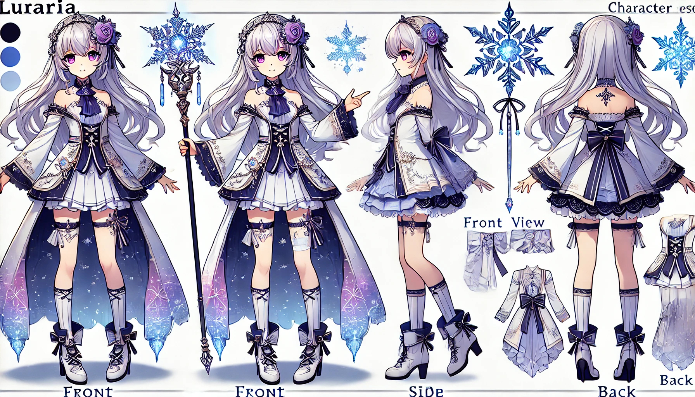

# 🌟 Lunaria - A Multifunctional Discord Bot 🌟(開発中)　


---

## 📖 **目次**
1. [プロジェクト概要](#プロジェクト概要)
2. [特徴](#特徴)
3. [モチーフキャラ - ルナリア](#モチーフキャラ---ルナリア)
4. [プロジェクトツリー](#プロジェクトツリー)
5. [技術スタック](#技術スタック)
6. [セットアップ方法](#セットアップ方法)
7. [スクリーンショットとデモ](#スクリーンショットとデモ)
8. [開発者について](#開発者について)
9. [ライセンス](#ライセンス)

---

## 📝 **プロジェクト概要**
Lunariaは、Discordサーバーを次のレベルに引き上げるために設計された多機能ボットです。  
エンタメ要素からサーバー管理ツール、ChatGPTの連携による高度な対話機能まで幅広い機能を提供します。

> ✨ **魔法をテーマにしたデザイン**と**直感的なダッシュボード**で、  
> あなたのサーバーを魔法のように輝かせます！

---

## 🌟 **特徴**
- 🎨 **AI連携**: ChatGPTを活用した自然対話や画像生成。
- 🎮 **エンターテインメント**: クイズ、音楽再生、ミニゲーム。
- 📅 **自動化機能**: 毎日の記念日通知やスケジュール設定。
- 🔧 **リアルタイム編集**: 埋め込みメッセージをダッシュボードで直感的に操作。
- 📊 **統計機能**: サーバーアクティビティの分析と可視化。

---

## 🧙‍♀️ **モチーフキャラ - ルナリア**


- **名前**: ルナリア (Lunaria)
- **年齢**: 17歳
- **属性**: 氷魔法
- **設定**:
  - 星の魔法使いの末裔で、知識と力を併せ持つ少女。
  - 彼女の杖は、氷の結晶から作られており、星と氷の魔力を象徴しています。
- **ビジュアル**:
  - 以下はルナリアの三面図です。


---

## 🗂️ **プロジェクトツリー**
```plaintext
lunaria-bot/
├── src/
│   ├── commands/
│   │   ├── admin.js        # 管理者向けコマンド
│   │   ├── fun.js          # エンターテインメントコマンド
│   │   ├── moderation.js   # モデレーションコマンド
│   │   └── utilities.js    # ユーティリティコマンド
│   ├── events/
│   │   ├── ready.js        # Bot起動時のイベント
│   │   ├── message.js      # メッセージイベント
│   │   └── guild.js        # サーバー関連イベント
│   ├── utils/
│   │   ├── logger.js       # ログ管理
│   │   ├── database.js     # データベース操作
│   │   └── apiHandler.js   # APIリクエスト管理
│   ├── bot.js              # メインBotスクリプト
│   └── config.json         # 設定ファイル
├── dashboard/
│   ├── public/             # 静的リソース
│   ├── src/                # ダッシュボードフロントエンド
│   │   ├── components/     # Reactコンポーネント
│   │   ├── pages/          # 各ページ
│   │   └── App.js          # エントリポイント
│   ├── package.json        # フロントエンド依存関係
│   └── tailwind.config.js  # Tailwind設定
├── .env                    # 環境変数
├── package.json            # サーバー依存関係
├── LICENSE                 # ライセンス
└── README.md               # プロジェクト概要
```

---

## 🛠️ **技術スタック**
-  **フロントエンド**: React, TailwindCSS
-  **バックエンド**: Node.js, Express
-  **Bot**: Discord.js
-  **データベース**: MongoDB
-  **AI API**: OpenAI (ChatGPT, DALL-E)

---

## 🚀 **セットアップ方法**
1. リポジトリをクローン:
   ```bash
   git clone https://github.com/your-repo/lunaria-bot.git
   cd lunaria-bot
   ```

2. 必要なパッケージをインストール:
   ```bash
   npm install
   ```

3. `.env`ファイルを作成し、以下を追加:
   ```env
   DISCORD_TOKEN=your_discord_bot_token
   CLIENT_ID=your_discord_client_id
   ```

4. ボットを起動:
   ```bash
   npm start
   ```

---

## 🎥 **スクリーンショットとデモ**

> ダッシュボード例


> ボットとの対話例

---

## 👩‍💻 **開発者について**
- **名前**: [いゔる。(ivuruGG)](https://ivurugg.jp)
  -  **X**: [@ivuruGG](https://x.com/ivurugg)
  -  **Instagram**: [@ivurugg](https://www.instagram.com/ivurugg/)
  -  **GitHub**: [ivurugg](https://github.com/ivurugg)

---

## 📜 **ライセンス**
このプロジェクトは [MIT ライセンス](./LICENSE) のもとで提供されています。

---


